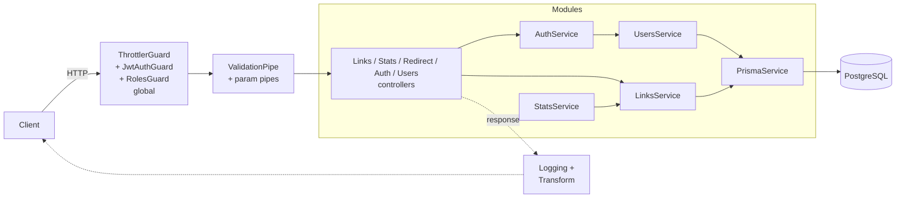
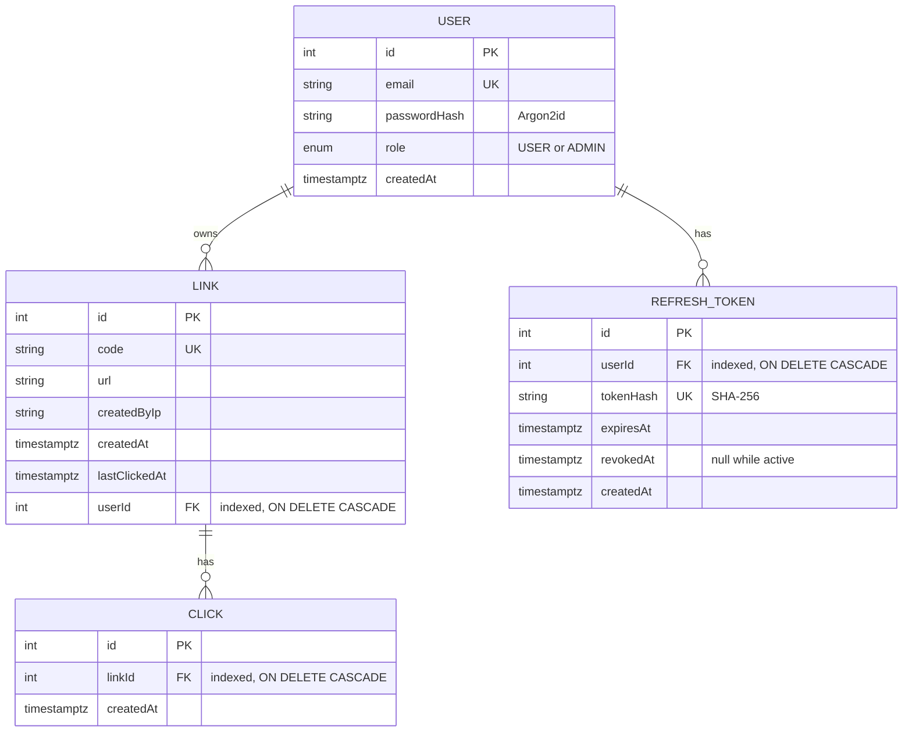

# shortlink

[](https://github.com/huseyincansoylu/shortlink-api/actions/workflows/ci.yml)

A URL shortener API with click analytics, built with **NestJS 12**, **Prisma 7** and **PostgreSQL**.

Beyond a basic link shortener, the project focuses on backend fundamentals: a layered module architecture, secure-by-default access control, transactional writes, and database access patterns that were measured with `EXPLAIN ANALYZE`.

## Highlights

- **Layered architecture.** Controllers only handle HTTP. Business rules live in services, and persistence goes through a single `PrismaService`.
- **Secure by default.** A global JWT guard protects every route, and public endpoints must opt out explicitly with `@Public()` ([ADR 0001](docs/adr/0001-secure-by-default-global-guard.md), [ADR 0005](docs/adr/0005-jwt-global-guard.md)). The user and their role are loaded on every authenticated request, so a role change or a deleted account takes effect immediately ([ADR 0008](docs/adr/0008-load-user-on-each-request.md)).
- **Consistent writes.** A click is recorded and `lastClickedAt` is updated in one transaction ([ADR 0002](docs/adr/0002-atomic-click-recording.md)).
- **Measured performance.** A foreign key index made selective lookups about 50× faster ([ADR 0003](docs/adr/0003-index-clicks-link-id.md)). Keyset pagination costs the same on any page, 0.035 ms compared with 40.69 ms for a deep `OFFSET` ([ADR 0004](docs/adr/0004-cursor-pagination.md)).
- **No N+1 queries.** Link listings load click counts in a single aggregated query.
- **Safe password storage.** Passwords are hashed with Argon2id, and the hash never leaves the users service. A duplicate email returns `409 Conflict` instead of a database error, and a failed login returns the same `401` whether the email is unknown or the password is wrong, so the response does not reveal which accounts exist.
- **Revocable sessions.** Short-lived JWT access tokens are paired with opaque refresh tokens that are stored hashed, rotated on every use, and revoked for the whole account when reuse is detected. Concurrent refreshes of the same token are serialized, so only one succeeds ([ADR 0006](docs/adr/0006-refresh-token-rotation.md)).
- **Object-level authorization.** Every link belongs to the user who created it, and only that user or an admin can delete it. The owner comes from the JWT, never from the request body ([ADR 0007](docs/adr/0007-link-ownership.md)).
- **Role-based access control.** Users are `USER` or `ADMIN`. Admin-only routes are marked with `@Roles('ADMIN')` and checked by a global `RolesGuard` that runs after authentication. Ownership rules that need the resource itself stay in the service ([ADR 0009](docs/adr/0009-role-based-access-control.md)).
- **Data minimization.** The creator's IP address is stored for abuse investigations but is never returned by the API, the same way password hashes are excluded at the query level.
- **Rate limiting.** A global throttler allows 100 requests per minute per IP and route, 5 per minute on login and registration, and none on redirects. It runs before authentication, so rejected requests never reach the database or the password hash check ([ADR 0010](docs/adr/0010-rate-limiting.md)).
- **Security headers.** `helmet` sets HSTS, `X-Content-Type-Options`, `X-Frame-Options` and a restrictive Content Security Policy on every response, and removes `X-Powered-By`.
- **Fail-fast configuration.** Environment variables are validated at startup with `class-validator`.
- **Uniform API.** Every success response is wrapped in `{ data }`, and every error has the same shape with `statusCode`, `message`, `path` and `timestamp`.

## Architecture





## API

| Method   | Path                  | Auth       | Description                                                                                                         |
| -------- | --------------------- | ---------- | ------------------------------------------------------------------------------------------------------------------- |
| `POST`   | `/links`              | Bearer JWT | Create a short link owned by the authenticated user. Body: `{ "url": "https://..." }`                               |
| `GET`    | `/links?limit=10`     | public     | List links with their click counts (`limit` 1–100)                                                                  |
| `GET`    | `/links/mine`         | Bearer JWT | Links owned by the authenticated user, with click counts                                                            |
| `GET`    | `/links/:code`        | public     | Link details with click count                                                                                       |
| `GET`    | `/links/:code/clicks` | public     | Click history with cursor pagination (`limit`, `cursor`)                                                            |
| `DELETE` | `/links/:code`        | Bearer JWT | Delete a link and its clicks (204). Owners can delete their own links and admins can delete any link. Otherwise 403 |
| `GET`    | `/stats`              | public     | Summary statistics                                                                                                  |
| `POST`   | `/auth/register`      | public     | Register a user. Body: `{ "email", "password" }` (8–128 chars)                                                      |
| `POST`   | `/auth/login`         | public     | Log in with `{ "email", "password" }`. Returns `accessToken` (JWT, 15 min) and `refreshToken` (7 days)              |
| `POST`   | `/auth/refresh`       | public     | Exchange `{ "refreshToken" }` for a new token pair. The old refresh token is revoked                                |
| `POST`   | `/auth/logout`        | public     | Revoke `{ "refreshToken" }` (204)                                                                                   |
| `GET`    | `/users`              | Admin      | List users without password hashes                                                                                  |
| `GET`    | `/auth/me`            | Bearer JWT | The authenticated user (`id`, `email`, `role`)                                                                      |
| `GET`    | `/:code`              | public     | Redirect (302) to the original URL and record the click                                                             |

Example:

```bash
curl -X POST localhost:3000/links \
  -H "authorization: Bearer $ACCESS_TOKEN" \
  -H 'content-type: application/json' \
  -d '{"url":"https://nestjs.com"}'

curl "localhost:3000/links/gw42r8/clicks?limit=20"
# { "data": { "items": [ ... ], "nextCursor": 20 } }

curl "localhost:3000/links/gw42r8/clicks?limit=20&cursor=20"
```

## Getting started

Requirements: Node.js 22 or newer, and Docker.

```bash
npm install
cp .env.example .env          # then set JWT_SECRET (32+ chars)
docker compose up -d          # PostgreSQL on localhost:5433
npx prisma migrate deploy
npm run db:generate
npm run start:dev
```

## Scripts

| Command              | Description                           |
| -------------------- | ------------------------------------- |
| `npm run start:dev`  | Start in watch mode                   |
| `npm test`           | Unit tests (Vitest)                   |
| `npm run test:e2e`   | End-to-end tests (needs the database) |
| `npm run lint`       | Type-aware linting (oxlint)           |
| `npm run typecheck`  | TypeScript type check                 |
| `npm run db:migrate` | Create and apply a migration          |

## Project structure

```
src/
├── common/         # cross-cutting: guards, pipes, filters, interceptors, decorators
├── config/         # environment validation
├── prisma/         # PrismaService (connection lifecycle)
├── links/          # links domain: controller, service, DTOs
├── users/          # user persistence, password hashing, admin user listing
├── auth/           # registration, login, refresh token rotation, JWT strategy, global JwtAuthGuard
├── stats/          # statistics
├── redirect/       # GET /:code (registered last, because it is a catch-all route)
└── main.ts
prisma/
├── schema.prisma
└── migrations/
docs/adr/           # architecture decision records
```

## License

[MIT](LICENSE)
