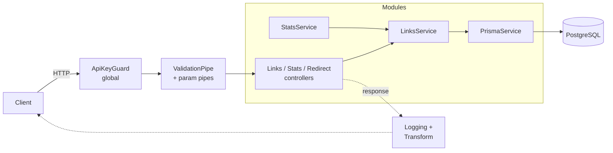
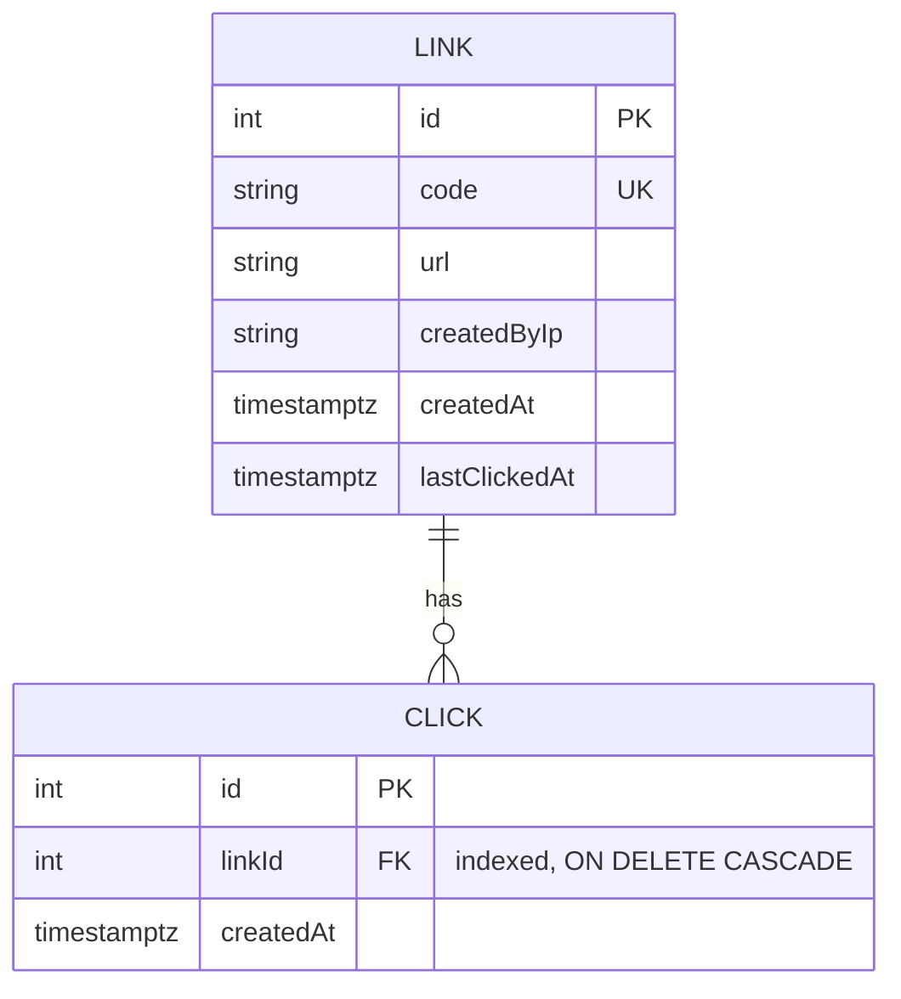

# shortlink

A URL shortener API with click analytics, built with **NestJS 12**, **Prisma 7** and **PostgreSQL**.

Beyond a basic link shortener, the project focuses on backend fundamentals: a layered module architecture, secure-by-default access control, transactional writes, and database access patterns that were measured with `EXPLAIN ANALYZE`.

## Highlights

- **Layered architecture.** Controllers only handle HTTP. Business rules live in services, and persistence goes through a single `PrismaService`.
- **Secure by default.** A global guard protects every route, and public endpoints must opt out explicitly with `@Public()` ([ADR 0001](docs/adr/0001-secure-by-default-global-guard.md)).
- **Consistent writes.** A click is recorded and `lastClickedAt` is updated in one transaction ([ADR 0002](docs/adr/0002-atomic-click-recording.md)).
- **Measured performance.** A foreign key index made selective lookups about 50× faster ([ADR 0003](docs/adr/0003-index-clicks-link-id.md)). Keyset pagination costs the same on any page, 0.035 ms compared with 40.69 ms for a deep `OFFSET` ([ADR 0004](docs/adr/0004-cursor-pagination.md)).
- **No N+1 queries.** Link listings load click counts in a single aggregated query.
- **Fail-fast configuration.** Environment variables are validated at startup with `class-validator`.
- **Uniform API.** Every success response is wrapped in `{ data }`, and every error has the same shape with `statusCode`, `message`, `path` and `timestamp`.

## Architecture





## API

| Method   | Path                  | Auth        | Description                                              |
| -------- | --------------------- | ----------- | -------------------------------------------------------- |
| `POST`   | `/links`              | public      | Create a short link. Body: `{ "url": "https://..." }`    |
| `GET`    | `/links?limit=10`     | public      | List links with their click counts (`limit` 1–100)       |
| `GET`    | `/links/:code`        | public      | Link details with click count                            |
| `GET`    | `/links/:code/clicks` | public      | Click history with cursor pagination (`limit`, `cursor`) |
| `DELETE` | `/links/:code`        | `x-api-key` | Delete a link and its clicks (204)                       |
| `GET`    | `/stats`              | public      | Summary statistics                                       |
| `GET`    | `/:code`              | public      | Redirect (302) to the original URL and record the click  |

Example:

```bash
curl -X POST localhost:3000/links \
  -H 'content-type: application/json' \
  -d '{"url":"https://nestjs.com"}'

curl "localhost:3000/links/gw42r8/clicks?limit=20"
# { "data": { "items": [ ... ], "nextCursor": 20 } }

curl "localhost:3000/links/gw42r8/clicks?limit=20&cursor=20"
```

## Getting started

Requirements: Node.js 22 or newer, and Docker.

```bash
npm install
cp .env.example .env          # then set API_KEY (at least 8 characters)
docker compose up -d          # PostgreSQL on localhost:5433
npx prisma migrate deploy
npm run db:generate
npm run start:dev
```

## Scripts

| Command              | Description                           |
| -------------------- | ------------------------------------- |
| `npm run start:dev`  | Start in watch mode                   |
| `npm test`           | Unit tests (Vitest)                   |
| `npm run test:e2e`   | End-to-end tests (needs the database) |
| `npm run lint`       | Type-aware linting (oxlint)           |
| `npm run typecheck`  | TypeScript type check                 |
| `npm run db:migrate` | Create and apply a migration          |

## Project structure

```
src/
├── common/         # cross-cutting: guards, pipes, filters, interceptors, decorators
├── config/         # environment validation
├── prisma/         # PrismaService (connection lifecycle)
├── links/          # links domain: controller, service, DTOs
├── stats/          # statistics
├── redirect/       # GET /:code (registered last, because it is a catch-all route)
└── main.ts
prisma/
├── schema.prisma
└── migrations/
docs/adr/           # architecture decision records
```

## Roadmap

- [ ] User accounts with Argon2id password hashing
- [ ] JWT authentication with refresh token rotation, and role-based access control
- [ ] Rate limiting and security headers
- [ ] Integration tests with Testcontainers
- [ ] Redis caching for redirects
- [ ] Asynchronous click ingestion with BullMQ
- [ ] Structured logging (Pino) and OpenTelemetry tracing
- [ ] Container image, health checks and graceful shutdown

## License

[MIT](LICENSE)
